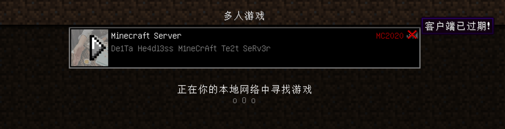
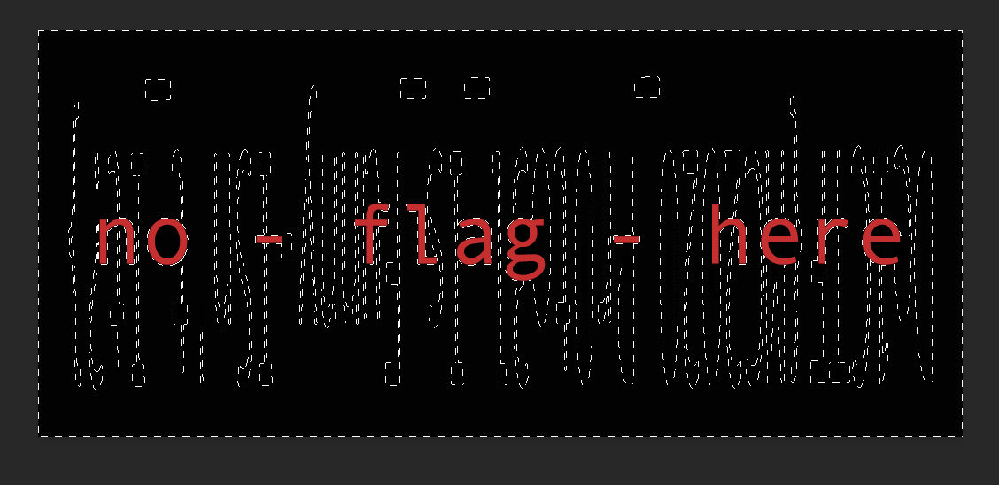

## misc - mc_joinin

The minecraft game service is opened on default port `25565`.

We add the server to mutil-player server list. It seems that it's not supported by our client. The server is using 'MC2020' as service and our client is seems to be outdated.



From the website we know that, `MC2020` is developed based on `1.12`.

```
Minecraft 20.20 is developed by De1ta Team based on 1.12
```

Of course there is a thick. The server is still using `1.12` protocol to communicate. But in the 'protocol version checking' procedure, it's just failed.

It comes out two solutions. One, we just simply replace the 'version' in the procedure during communication between the server and the client by a custom proxy. Another, we simulate the client's function, login to the game.

Reference:

```
Minecraft 1.12 Protocol(Version: 335) Wiki Page
https://wiki.vg/index.php?title=Protocol&oldid=13223
```

`exp.go` is the exploit written in golang, containing with two solutions mentioned above.

The flag is hidden in the image from `imgur`.



`De1CTF{MC2020_Pr0to3l_Is_Funny-ISn't_It?}`

## misc - mc_joinin

因为想要出一道mc题，然后红石题以前比赛已经出现过，所以就没有出了。

最近在搞网络协议开发这块，所以熟悉了一下mc协议，发现可以在此处作文章。回想起中科大校赛黑曜石浏览器那题改ua版本号，发现协议通讯也涉及版本验证，所以出了这么一道题。

去重新写协议很麻烦，偷懒在某hub找到一个轮子[TyphoonMC/TyphoonLimbo](https://github.com/TyphoonMC/TyphoonLimbo)，直接魔改。

游戏开放在 `25565` 端口。

添加服务器到列表里，发现是 `MC2020` 服务端。


从官网得知 `MC2020` 是基于 `1.12` 开发的。

```
Minecraft 20.20 is developed by De1ta Team based on 1.12
```

所以我们可以用 `1.12` 的协议去通讯。

这里有两种实现方法。第一种是 MITM 中间人篡改通讯数据包里的版本号，绕过验证，成功登录游戏。第二种是直接模拟通讯协议，实现通讯。

参考资料：

```
Minecraft 1.12 Protocol(Version: 335) Wiki Page
https://wiki.vg/index.php?title=Protocol&oldid=13223
```

`exp.go` 包含两种解法。

flag藏在 `imgur` 的图片里。


`De1CTF{MC2020_Pr0to3l_Is_Funny-ISn't_It?}`